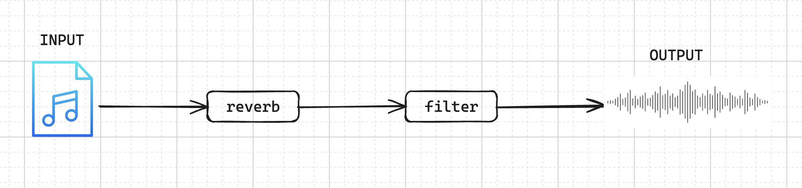

Before I get into the article, I need to open with the most pressing question, what in the name of rust, are you trying to do?

Well currently the initial essence of what is boils down to is a sound generator - yes, with AI, which I honestly think is fine.

So what is the reason I am making it? Well I have a few years of experience with music production, and while I enjoy the process of creating music,
there is a small thing that most music producers dread - sound design. Sound design is something like a dark art, and this can halt progress of creating music entirely while you are
looking for a sound or creating one.

This is just to simply move that process forward, by making it easier to find a sound you'd like.

## The Signal Chain

This post will be about the signal chain, more than the rest of the effects that is going to be added - first of which was the filters.
So what exactly is the signal chain? Imagine we have a sound that play when we hit the play button, the signal chain is the process that
the sound will go through before the sound will hit your speakers.

Hopefully this will diagram, will be more helpful...



## How did I implement this?

Since this is a web application we are using are going to be using a 3rd party application to handle the signal processing, the library we are using is [Elementary Audio](https://www.elementary.audio/){:target="_blank"}.  
Elementary Audio allows for an easier time to connect to the Audio Context to the browser.

For the main web application, we are using Angular, because I like it, so...deal with it.

For the sound to change in real-time, we need to look at how the sound will need to react with the input changes.
So I implemented the signal-chain as an object array - holding each signal with the and the associated functions and effect parameters needed to process them.
Here is an example of a object that will get used

```js
    // IGNORE THE UPDATE SIGNAL CHAIN FOR NOW
    this._audio.updateSignalChain(
      {
        effectName: 'filter',
        filter: {
          qFactor: 0,
          frequency: 20000,
          applyEffect: function (inputSignal: ElemNode) {
            if (!inputSignal) {
              return el.cycle(0);
            }
            return el.lowpass(
              el.const({ key: 'cut', value: 20000 }),
              this.qFactor,
              inputSignal,
            );
          },
        },
      },
      'filter',
    );
```

> On that note I just realised how bad the code highlighting is, there isn't that much I can do about it...I'm sorry...all of them kinda sucks.

As you can see most of the initial values are there for the effect to be processed, we are currently using elementary's built in lowpass filter effect.
This does get replace with a biquad filter which is more flexible for my use case.

We will use the `effectName` variable to get the information needed to process the audio signal. There is probably a better way to do it, but this works for now.

The signal chain object array is implemented using a observable to allow for reactivity with the signal chain when a input is triggered.

```js
  private signalChain: BehaviorSubject<any[]> = new BehaviorSubject<any[]>([]);
```

I have not created a type for the effects since I still need to consolidate what exactly is the same between all the effect, thus far they all are slightly different, making it a bit difficult
but `any` never hurt anyone...right?

The final bit of this implementation was making it reactive based on user input, the way this works was with each input, we trigger an event,
after which we figure out the mapped frequency value or the Q factor value and update the signal chain using our `audioService`'s `updateSignalChain` function, which just updates the
`signalChain` observable as needed.

Updating on user input will follow this same pattern as the following pattern.

```js
  setFilterValue($event: number) {
    this.plotFrequencyGraphic($event);

    const mappedFrequency = $event * 200;

    const coeffs = this.coeffs;

    this._audio.updateSignalChain(
      {
        effectName: 'filter',
        filter: {
          qFactor: 0,
          frequency: mappedFrequency,
          applyEffect: function (inputSignal: ElemNode): ElemNode {
            if (!inputSignal) {
              return el.cycle(0);
            }
            return el.biquad(
              coeffs.b0,
              coeffs.b1,
              coeffs.b2,
              coeffs.a1,
              coeffs.a2,
              inputSignal,
            );
          },
        },
      },
      'filter',
    );
  }
```

## Conclusion

My signal chain is implemented using a mix of object arrays and observables to add reactivity to my web application - this will allow us to update the effect in real-time.
There will be more information that follows as to how I implemented the effects themselves, as this is out of the scope of this article. Next we'll take a look at the filter,
which uses the biquad filter and why I used that specifically.

> Since this is my first technical article, please let me know where I can improve, you can find me on twitter/X - @0x_thurling
