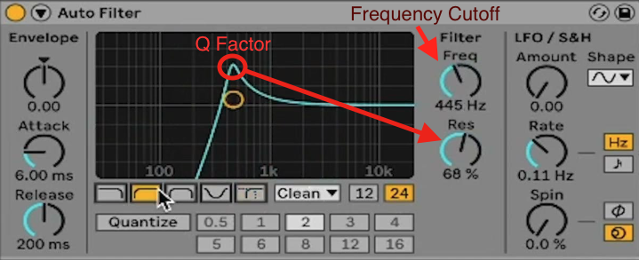

Following on from the previous my previous overview on my solution to setting up a signal chain using [Elementary Audio](https://www.elementary.audio/){:target="_blank"},
we are going to look at implementing a filter for my audio web application, so far I have added a high-pass and a low-pass filter, this is honestly more than enough for what I am considering what I want this thing to do.

> NOTE: This is from a developers perpective, as I am still learning DSP myself, I am simply trying to convey the information I found simply. Frankly, there's still much I do not understand, this is not a comprehensive overview of how the math works, just enough to get you going in a direction and the parts I found useful for my application.

## What is a Filter

Well, in simple terms, it'll take an input signal, i.e. the soundfile usually, .wav, .mp3, etc. and remove specific frequency energy from that signal. So for a high-pass filter, we allow high pass energy to pass through while removing the lower frequency information. The header image displays this perfectly - it's a high-pass filter that can find the the DAW [FL Studio](https://www.image-line.com/fl-studio/){:target="_blank"}.

And as you can probably guess, a lowpass filter is simply the opposite of this.

There are multiple types of filters that you can use. You can choose, as far as I understand, between two options, FIR and IIR filter, which stands for Finite Impulse Response and 
Infinite Impulse Response, and both of them have their own characteristics, however in the name of simplicity, for my filter, I implemented an IIR filter for a few reasons:
 - IIR filters have the computations needed to create the sharp cutoff that you would want for a filter application, making it more efficient
 - Since the IIR Filter's have less computations needed - it's more used suited to real-time application, especially when it come to a web application.

> TL; DR : IIR Filters are less resource intensive, therefore more suited to real-time aplications

## Implementing the filter

I am using a biquad filter, which is a type of IIR filter, the reason I chose this, is that a biquad filter is very flexible, by just changing the co-effs of the function, we are able to produce different results.

To get the scary bit out of the way lets go over the co-effs that will need to be calculated before we create the filter. We will need the following coefficients $b0, b1, b2, a0, a1, a2$

I'm not going into the deep-end of signal processing, I'll add a few links for you to investigate by yourself at the end of the article.

So before we can have a figure out our coefficients, we need to find omega ($\omega$) and alpha($\alpha$). `Omega` can be found by dividing $2 * \pi * FC$ (where FC is our frequency cutoff) by our sample rate, while `Alpha` can be found by dividing the $\sin(\omega)$ by $2 * Q$ where Q is our Q factor or in simple terms our resonance.
The final equations will be the following, using a sample rate of 44100Hz:

$$
\omega = \frac{2 * \pi * FC}{44100}
$$

$$
\alpha = \frac{\sin(\omega)}{2 * Q}
$$

*To give a more visual representation of FC and Q in an application, let's have a look at Ableton's filter:*



Finding all our coefficients:

$$
b0 = \frac{1-\cos(\omega)}{2}
$$

$$
b1 = 1-\cos(\omega)
$$

$$
b2 = \frac{1-\cos(\omega)}{2}
$$

$$
a0 = 1 + \alpha
$$

$$
a1 = -2 * \cos(\omega)
$$

$$
a2 = 1-\alpha
$$

This can be represented in code the following way:

```js
  biquadLowpassCoefficients(fc: number, Q: number) {
    const omega = (2 * Math.PI * fc) / 44100;
    const alpha = Math.sin(omega) / (2 * Q);

    const b0 = (1 - Math.cos(omega)) / 2;
    const b1 = 1 - Math.cos(omega);
    const b2 = (1 - Math.cos(omega)) / 2;

    const a0 = 1 + alpha;
    const a1 = -2 * Math.cos(omega);
    const a2 = 1 - alpha;
  }
```

After the co-efficients are done, you are good to go, since we are using the [Elementary Audio](https://www.elementary.audio/){:target="_blank"} library we can use their biquad function.
I am probably too stupid at the moment to explain it properly and this is a good way to get started.

This can be done easily with the following code snippet

```js
return el.biquad (
  coeffs.b0,
  coeffs.b1,
  coeffs.b2,
  coeffs.a1,
  coeffs.a2,
  inputSignal,
);
```

And voila, you now have a low-pass filter implemented in JavaScript.

### Extra Info

If you want to learn more about how to implement this library easily on the client-side (your website) you can go to [Elementary Audio](https://www.elementary.audio/){:target="_blank"}.
For more information on how to change the co-efficients to change the type of filter to something like a high-pass filter, you can go have a look here [Cookbook formulea for audio equalizer biquad coefficients](https://webaudio.github.io/Audio-EQ-Cookbook/audio-eq-cookbook.html){:target="_blank"}

If you want to get more info, don't hesitate to hit me up on Twitter/Threads, and I'll try to help as best I can.