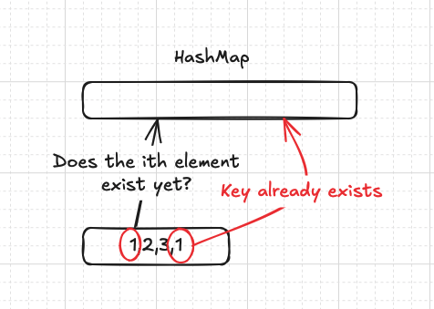

## My LeetCode journey

This will be the start of a running series, it's not going to be very in-depth, it's mainly around the problems I did and the solutions I found along with some extra explanations, so without further ado.

## Valid Anagram - `Easy`

My Solution:

```python
class Solution(object):
    def isAnagram(self, s, t):
        """
        :type s: str
        :type t: str
        :rtype: bool
        """
        
        s_dict = {}
        t_dict = {}

        for c in s:
            if c not in s_dict:
                s_dict[c] = 1
            else:
                s_dict[c] = s_dict[c] + 1

        for c in t:
            if c not in t_dict:
                t_dict[c] = 1
            else:
                t_dict[c] = t_dict[c] + 1

        if len(s_dict.keys()) > len(t_dict.keys()):
            for k in s_dict:
                if s_dict.get(k) != t_dict.get(k):
                    return False
        else:
            for k in t_dict:
                if s_dict.get(k) != t_dict.get(k):
                    return False

        return True
```

**Why this works - time and space complexity**

This works by adding each occurrence of the characters in the string to a HashMap, once the values are stored in the HashMap we can check if the amount of times the characters show up in the string is the same, we do this by looping over the HashMap and check the key-value pairs.

Using two hash maps cause the solution’s space complexity to be `O(n + m)` since we need to allocate extra memory based on both string inputs.

For time complexity I am looping over the strings in total of 3 times making it roughly `O(n + m + k)` , which isn’t ideal.

**Further optimisations**

I can re-arrange the if statement at the end of my solution to be at the top of my function to check the lengths, since if two words have different lengths they cannot be anagrams of each other.

```python
if len(string_1) != len(string_2):
	return False
```

## Contains Duplicate - `Easy`

My Solution

```python
class Solution(object):
    def containsDuplicate(self, nums):
        """
        :type nums: List[int]
        :rtype: bool
        """
        numbers = {}

        for n in nums:
            if n not in numbers:
                numbers[n] = True
            else:
                return True

        return False
```

 **Why this works - space and time complexity**

This achieves a space complexity of `O(n)` since we can use memory for up to each element of the array to store it in the HashMap.



This can also take up to `O(N)` time complexity since we can possibly iterate over the entire array making the complexity equal to the length of the input `(N)` .
