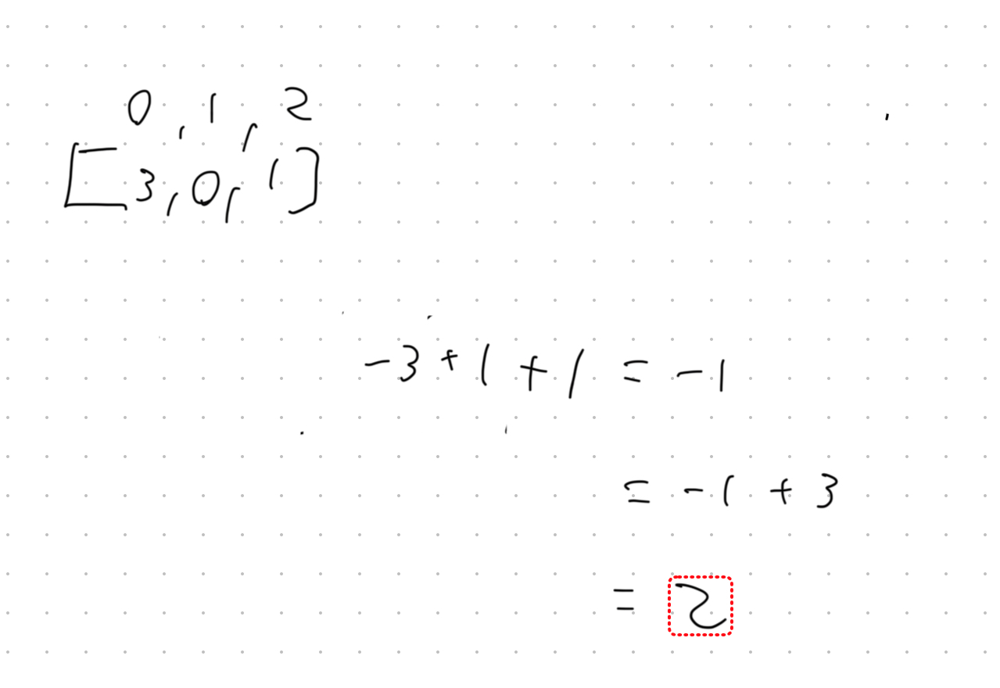

## My LeetCode journey part 2

All I can say for certain is I need extensive amounts of practice...my word.

## Contains Duplicate 2 - `easy`

**Solution**

```python
class Solution(object):
    def containsNearbyDuplicate(self, nums, k):
        """
        :type nums: List[int]
        :type k: int
        :rtype: bool
        """

        index = {}

        for i, t in enumerate(nums):
            if t in index and i - index[t] <= k:
                return True
            else:
                index[t] = i

        return False

```

**Why this works - space and time complexity**

For this we only need to loop over the `nums` once this making the time complexity `O(n)` which is the smallest I could get it. Once we loop over the value once we store the index as the value, and the value as the key, i.e.

```python
list = [1,2,3]

dict = {
	2: 1 #index
}
```

This would allow us to check if the value has already been called and also make the space complexity `O(n)`  since the hash map can grow as large as the original `nums` array.

## Missing Number -`easy`

**My Solution**

```python
class Solution(object):
    def missingNumber(self, nums):
        """
        :type nums: List[int]
        :rtype: int
        """

        temp = 0
        for i in range(len(nums)):
            temp += i - nums[i]

        return temp + len(nums)
```

**Why this works - time and space complexity**

Since I am only iterating over the `nums` list/array once the time complexity is going to be `O(n)` and since we only use one variable to store the temp values, the space complexity will remain constant at `O(1)` 

**Extra Information**


