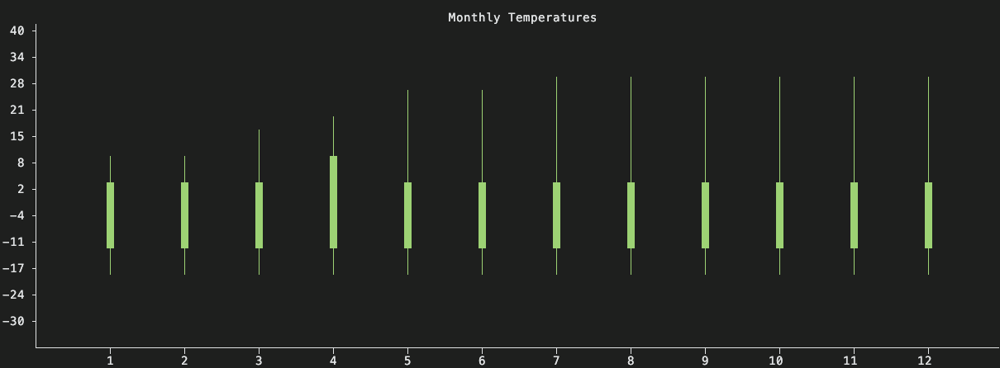
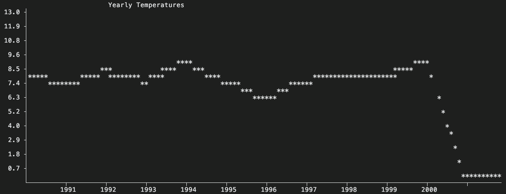

## Creating different charts for the terminal in C++

This is a smaller project to test how to create different chart in the terminal with C++

### Candlestick Chart

The first test was to create a Candlestick chart similar to those seen in financial industries
, specifically those that usually seen on Trading platforms



### Normal Graph chart

Next on the list was just to create a normal line chart connecting different (x, y) positions at equidistant point along the x-axis, the final result can be seen in the image below



To achieve this, I used linear interpolation to deternine the y-coords for the corresponding x-character coords. In order to achieve this, we used the following formula:

$$
    x_1 +\frac{i}{n-1}(x_2-x_1)
$$

Which is the following code:

```cpp
double ChartRenderer::linearSpace(double y1, double y2, double i) {
  return y1 + (i / (10 - 1)) * (y2 - y1);
}
```

For the code, you can have a look here:

<div class="repo-card" data-repo="0xThurling/candlesticks"></div>
